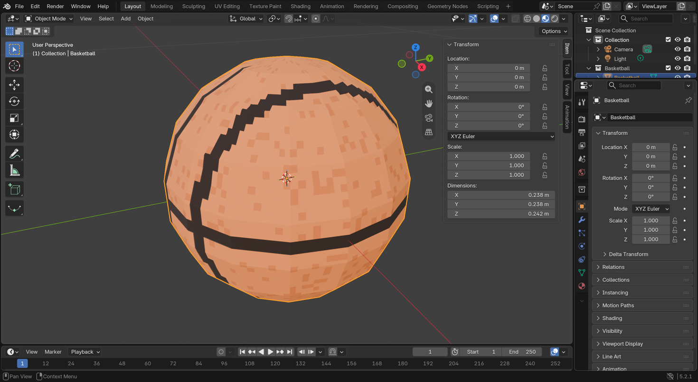
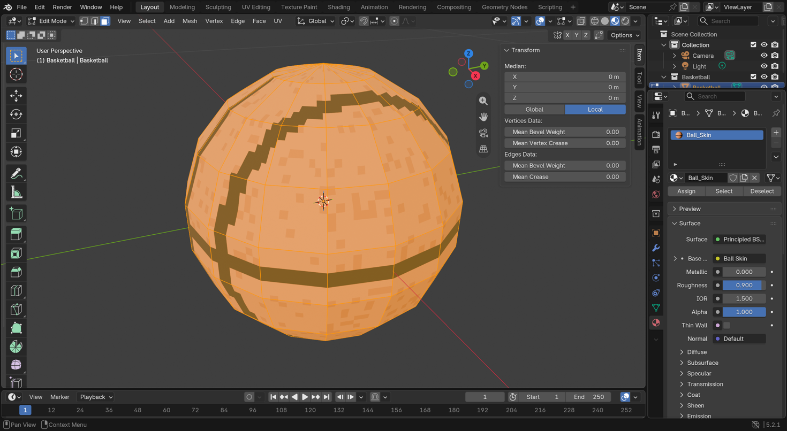
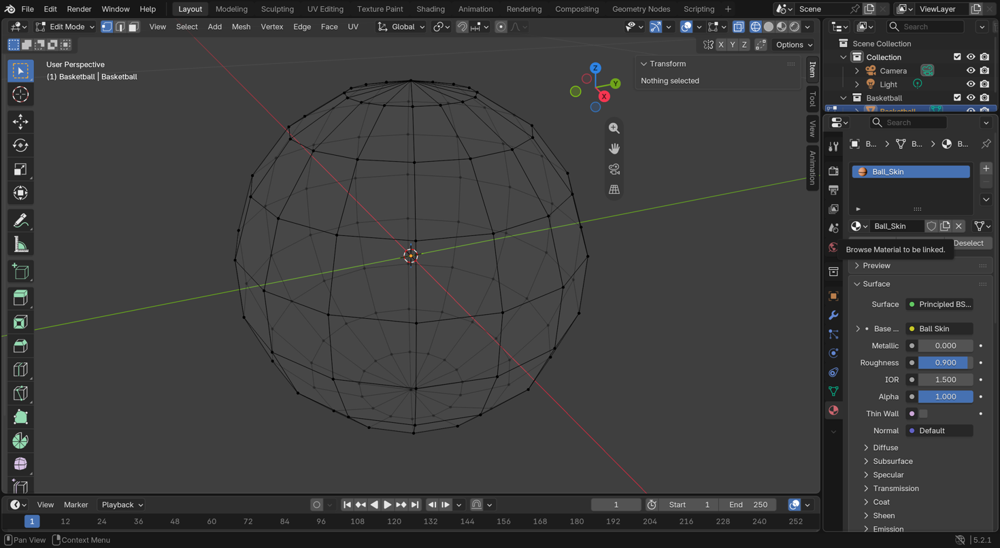
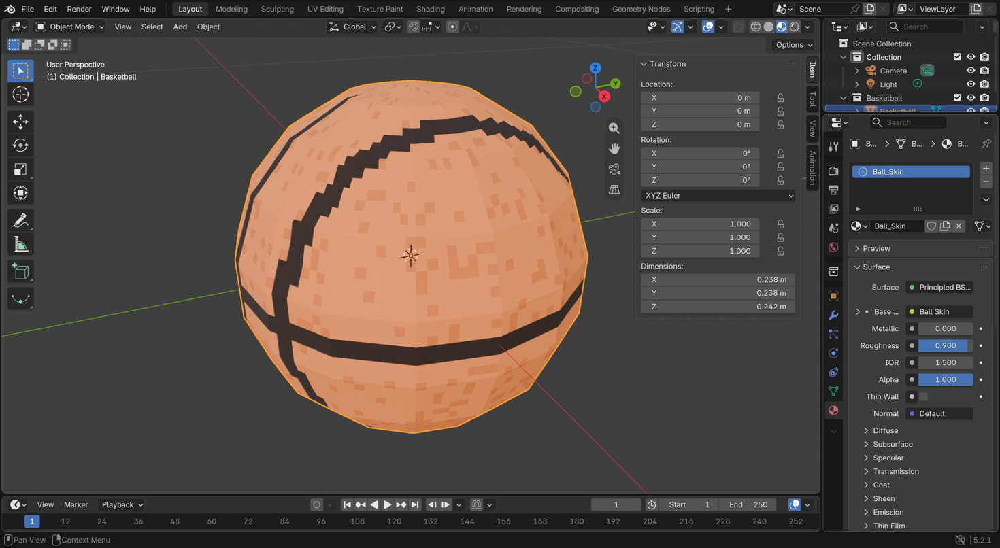
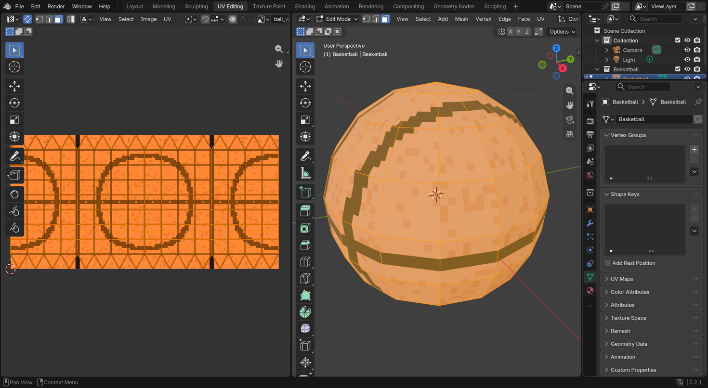
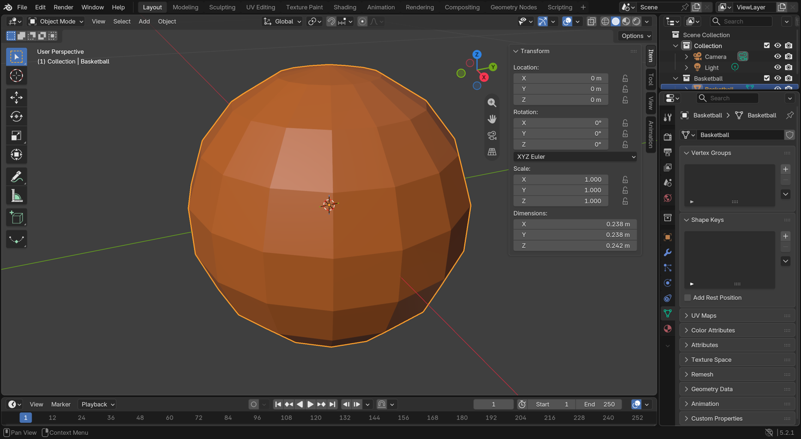
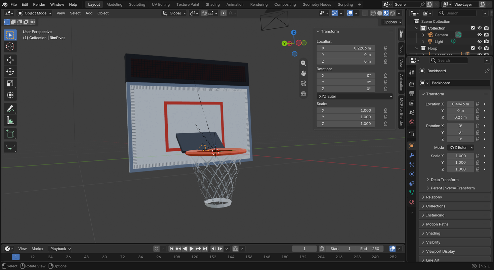
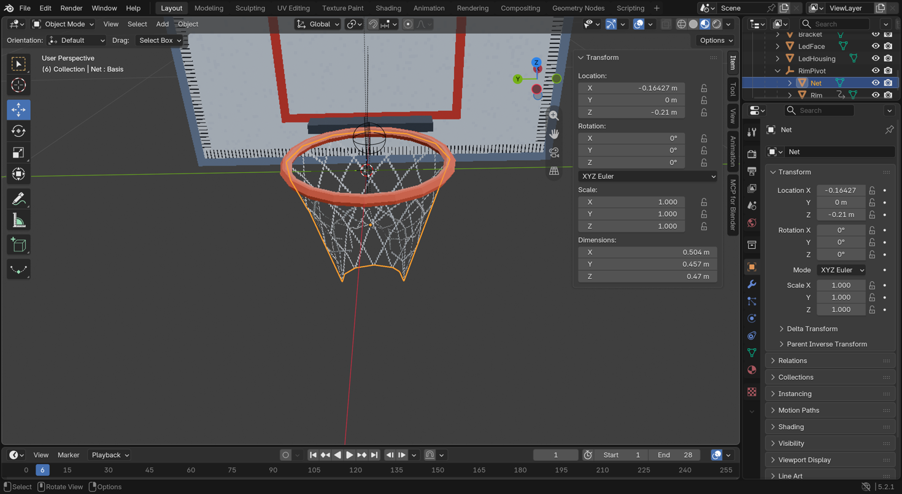

# Blender 101 — the Hoop Shoot basketball

A first walk through Blender using one asset: the blocky orange basketball in
`art/blender/basketball.blend`. Blender 5.2.1 LTS, macOS. Everything below is
what you see when you open that file.

Files in play:

| File | Role |
|---|---|
| `art/blender/basketball.blend` | Source model. Edit this. Godot ignores `art/` (`art/.gdignore`). |
| `assets/textures/ball_wrap.png` | The ball's skin: a 512×256 image wrapped around the sphere (§6). |
| `assets/balls/classic/basketball.glb` | Game-ready export, skin embedded, inside the classic ball's cosmetic-set folder. |
| `tools/aseprite/gen_ball_wrap.lua` | Draws the skin (seams as real sphere geometry projected to the image). |
| `tools/blender/build_basketball.py` | Rebuilds the `.blend` and `.glb` from scratch, headless. |
| `tools/blender/ui_screenshots.py` | Regenerates the screenshots in `docs/img/blender/`. |

Rebuild everything from the terminal (no window opens):

```
cd hoop_shoot
/Applications/Aseprite.app/Contents/MacOS/aseprite -b --script tools/aseprite/gen_ball_wrap.lua
/Applications/Blender.app/Contents/MacOS/Blender -b --python tools/blender/build_basketball.py
```

---

## 1. The window at a glance



Blender is one window split into **areas**. Every area can be turned into any
editor type (the icon at each area's top-left corner), but the default Layout
workspace gives you these five:

| Where | Area | What it is for |
|---|---|---|
| Center | **3D Viewport** | Where you look at and edit the model. Most of your time is here. |
| Top right | **Outliner** | The scene tree. `Scene Collection > Basketball > Basketball` is our object inside its own collection. Camera and Light live in the default collection. Eye icon = hide, camera icon = hide in render. |
| Bottom right | **Properties** | A tabbed panel of settings for whatever is selected. The vertical strip of icons on its left edge are the tabs (see §6). |
| Bottom | **Timeline** | Animation frames. Ignore it for static models. |
| Very bottom | **Status bar** | Shows what the mouse buttons currently do, plus the Blender version. |

The **top bar** holds the menus (File, Edit, Render…) and the **workspace tabs**
(Layout, Modeling, Sculpting, UV Editing, Shading…). A workspace is just a saved
arrangement of areas. Layout is fine for everything in this guide.

Note the Item panel on the right of the viewport: the ball's **Dimensions** read
0.238 × 0.238 × 0.242 m. Blender units are meters, same as the sim, and
`SimConstants.R_BALL` is 0.121 m. X and Y are slightly under the diameter because
the flat facets cut the corners of the sphere.

## 2. The viewport header, left to right

Look at the strip along the top of the 3D Viewport in the screenshot above.

- **Editor type** icon (grid with arrow). Leave it.
- **Object Mode** dropdown. The big one. *Object Mode* moves whole objects; *Edit
  Mode* edits the vertices, edges and faces inside one object. `Tab` toggles
  between the two.
- **View / Select / Add / Object** menus. Everything you can do is in a menu
  somewhere; the hotkeys are shown next to each entry, which is how you learn them.
- **Global** dropdown: transform orientation. **Pivot** icon next to it.
  **Snap** magnet and **proportional editing** circle. Leave all at defaults.
- Far right, five toggles:
  - **Visibility/selectability** filter (eye + arrow).
  - **Gizmo** toggle (the XYZ widget in the viewport).
  - **Overlays** toggle (grid, outlines, the orange selection highlight). Turn it
    off to see the model "clean".
  - **X-ray** (two overlapping squares). See and select through the model.
  - **Four shading balls**: Wireframe, Solid, Material Preview, Rendered. Solid is
    fast and gray-ish; Material Preview shows real colors (what the screenshots
    use); Rendered is the full lighting and is slow. Hotkey `Z` opens a pie menu
    for the same thing.

The row underneath has the **selection tool modes** (box, circle, lasso) on the
left and **Options** on the right.

Inside the viewport:

- **Left edge, `T`**: the **Toolbar**. Select, Cursor, Move, Rotate, Scale,
  Transform, Annotate, Measure, Add Cube. Hover for names. You will rarely click
  these because the hotkeys in §5 are faster.
- **Right edge, `N`**: the **Sidebar** with Item / Tool / View tabs. *Item* shows
  the selected object's Location, Rotation, Scale and Dimensions and lets you type
  exact numbers. This is also where the **MCP for Blender** tab lives.
- **Top-right corner of the viewport**: the **navigation gizmo** (colored XYZ
  balls) and four buttons: zoom, pan, toggle camera view, toggle
  perspective/orthographic.
- The **orange dot** in the middle of the ball is the object's **origin**. The
  game rotates and squashes the ball around this point, so it must stay at the
  center of the mesh.
- The **red and green lines** are the world X and Y axes. Blender is **Z-up**;
  Godot and glTF are Y-up. The exporter converts, so never rotate the model to
  compensate.

## 3. Moving around

| Action | Mouse | Mac trackpad |
|---|---|---|
| Orbit | middle-drag | two-finger drag |
| Pan | `Shift` + middle-drag | `Shift` + two-finger drag |
| Zoom | scroll wheel | pinch, or `Ctrl` + two-finger drag |
| Frame selected | `Numpad .` or View > Frame Selected | same |
| Frame everything | `Home` | same |
| Front / Right / Top view | `Numpad 1` / `3` / `7` | see below |

You can also click-drag the navigation gizmo to orbit, or click one of its
colored balls to snap to that axis view.

No numpad? Edit > Preferences > Input > **Emulate Numpad** makes the number row
act as the numpad. Or press the **backtick key** for a view pie menu. If you use a
mouse without a middle button, enable **Emulate 3 Button Mouse** on the same page
(`Alt` + left-drag then orbits).

If you ever lose the model, press `Home`.

## 4. Selecting things

**Object Mode** (whole objects):

- Left-click selects one object, `Shift`+click adds to the selection.
- `A` selects all, `Alt`+`A` deselects all, click-drag box-selects.
- The last thing you clicked is the **active** object, drawn in a lighter orange.
  The Properties editor shows the active object.

**Edit Mode** (`Tab` with the ball selected) works on the mesh itself:



Three buttons appear next to the mode dropdown: **vertex, edge, face** select
mode. Hotkeys `1`, `2`, `3`. The screenshot is in face mode with every face
selected (orange fill). The menu bar has also grown Vertex / Edge / Face / UV
menus, which only make sense in Edit Mode.

The ball is a **UV sphere**: 32 columns (segments) around the equator and 25 rows
(rings) from pole to pole. That gives 800 faces. We chose an odd number of rings
so one row sits exactly on the equator, which is where the horizontal seam goes.

**The ball is the one asset that breaks the house style.** It is smooth-shaded
and linear-filtered, where everything else is flat-shaded pixel art. It earns the
exception by being the object the player stares at all game and the only truly
spherical prop — a faceted ball reads as a mistake in a way a faceted backboard
does not. Do not "fix" it back to flat.

The two counts do different jobs, and the distinction matters when it looks
wrong. **Rings** set how fine the surface is (each pole cap is a fan spanning
180/rings degrees of latitude — 9 rings gave a 20° cone, a visibly flat facet on
top and bottom). **Segments** set the SILHOUETTE, which is what actually reads as
"not round" at the size the ball occupies on a phone: 16 segments gave a visible
16-gon outline no amount of smooth shading could hide.

Selecting groups of faces the fast way:

- `Alt`+click an edge in edge or face mode selects the whole **loop** it belongs
  to. `Alt`+click a horizontal edge on the ball to grab an entire ring of faces.
- `Ctrl`+click extends the selection along the shortest path to the clicked face.
- `L` with the mouse over a face selects everything connected to it.
- In the Material tab, **Select** picks every face using the active material
  slot, handy on models with several materials.

Wireframe shading in Edit Mode shows the raw topology:



Every dot is a vertex. Nothing is selected, so the Item panel says so.

## 5. Grab, rotate, scale

With something selected, in either mode, press one key then move the mouse:

- `G` grab (move), `R` rotate, `S` scale.
- Follow with `X`, `Y` or `Z` to lock to one axis: `G Z` slides straight up.
- Type a number for exact amounts: `S 2` doubles the size, `R Z 90` rotates 90°
  around Z.
- Left-click or `Enter` confirms, right-click or `Esc` cancels.
- `Ctrl`+`Z` undoes. Blender keeps a long undo history (Edit > Undo History).

**Apply transforms before export.** If you scale the whole *object* in Object
Mode, Blender remembers it as a scale factor (visible in the Item panel), and the
mesh data underneath is still the old size. `Ctrl`+`A` > *All Transforms* bakes
that into the mesh so Scale reads 1.000 again. Game exporters expect that. The
build script already does it, which is why the screenshot shows Scale 1.000 and
Rotation 0°.

Scaling in *Edit Mode* changes the vertices directly and never needs applying.

## 6. Materials, and how a texture wraps a model

The vertical icon strip at the left of the Properties editor is its tab bar.
From the top: Tool, Render, Output, View Layer, Scene, World, Collection, then
the ones that depend on the selection: **Object** (orange square), **Modifiers**
(wrench), Particles, Physics, Constraints, **Object Data** (green triangle),
**Material** (red-orange sphere, at the bottom).



The ball has one **material slot**, `Ball_Skin`. It is a **Principled BSDF**,
Blender's default all-purpose shader, with its Base Color fed by an **Image
Texture** node that holds `ball_wrap.png`. Roughness 0.9, Metallic 0: matte
leather, not glossy PS2 plastic. Open the **Shading** workspace tab to see the
two nodes wired together.

### The picture-vs-skin mistake

The game's original `ball.png` was a 64×64 *picture* of a basketball: a circle
with seams drawn inside it, the way you would draw one for a 2D sprite. Put that
on a sphere and Blender does what it does with every texture: it stretches the
whole square once around the ball. The circle outline becomes a band around the
middle, the two side arcs land on the front and back, and everything near the
top and bottom of the image gets crushed into the poles. That is the "giant
seams" you saw.

A 3D texture is not a picture of the object. It is the object's **skin peeled
off and laid flat**, like a world map. Every vertex of the mesh has a **UV
coordinate**: a 2D point (U across, V up, both 0 to 1) saying where on the image
that vertex sits. The GPU paints each triangle with whatever part of the image
lies between its three UV points. The set of all those coordinates is the
model's **UV map**, stored in the Object Data tab under UV Maps.



The **UV Editing** workspace shows both halves at once: the 3D mesh on the right
and its UV map on the left, drawn over the texture. A UV sphere comes with a
built-in map that is an **equirectangular projection**: U is longitude, V is
latitude. The 16 columns of faces line up with 16 vertical strips of the image,
the 9 rows with 9 horizontal bands, and the top and bottom edges of the image
pinch into the two poles. Every world map you have ever seen has the same
distortion.

That is why `ball_wrap.png` is 512×256 (2:1, like a map) and why its seams are
drawn the way they are:

| Seam on the ball | On the flat image |
|---|---|
| Equator, a great circle | One horizontal line through the middle |
| Meridian, a great circle through the poles | Two vertical lines, at a quarter and three-quarters across |
| The two curved "( )" seams | Two closed loops, one centred in the image, one split across the left and right edges |

Eight panels, like a real ball. The meridian sits at longitude ±90 — **between**
the loops rather than through them — and that placement is what makes the count
work: V=6, E=12, so F = 2 − 6 + 12 = 8. Run it through the loop centres instead
and you get 12.

Two things are needed to make a meridian survive the pole pinch, which is why an
earlier version of this ball left it out. The brush is stretched horizontally by
1/cos(lat), because the map crowds columns toward the poles and a fixed-pixel
brush would lay down a seam that gets narrower in real arc terms the higher it
climbs. And a small polar cap is filled outright, because at the pole itself a
texture row *is* a single point, so even a compensated brush narrows to nothing
and leaves a pinhole. The cap reads as the seam junction a real ball has there.

The script `tools/aseprite/gen_ball_wrap.lua` computes those curves on the actual
sphere and projects them onto the image, so they land on the model as real
curves. Seam thickness is set in DEGREES of arc (5°), not pixels, so it holds if
the map is ever resized.

**The pebbling is PAINTED into the albedo**, as a gentle light/dark mottle —
pebble tops a touch lighter, the gaps a touch darker. It was briefly a normal
map, which lit the dots as real bumps and read as too heavy-handed at the size
the ball actually occupies. Note the paint carries no baked light direction: the
ball tumbles constantly, so any painted highlight would swing the wrong way.

The dots are placed on a latitude/longitude grid with *fewer per row as the rows
shrink*, and each dome is stretched horizontally by 1/cos(lat), so the grain is
even on the BALL rather than in the image — otherwise the equirect map crowds it
into a smear at the poles. `DOT_STEP_DEG` and `DOT_R_DEG` control the grain;
2.8°/1.25° reads as leather, 4° reads as golf-ball dimples, and below ~2.2° the
grain is too fine to survive at the size the ball actually occupies on screen.

Seams are drawn with a **soft-edged disc accumulated as coverage**, not a hard
square stamp. A square brush walking a near-vertical curve leaves stair-steps
that look fine on a faceted ball and obviously wrong on a smooth one.

Two constants shape the side seams, and both are overridable for sweeping
(`--script-param beta=52 --script-param bow=14 --script-param out=try.png`):

- **`BETA`** is the loops' angular radius. `cos(BETA)` is how far off-centre they
  sit, so a *smaller* angle pushes them *outward* toward the silhouette, where a
  real ball's seams live.
- **`BOW`** warps each loop off its plane, and it is the one that matters. A
  circle lying flat in a plane projects to a **perfectly straight line** when you
  view it edge-on — and since `BallPool` gives the ball a random orientation on
  every pickup, that view comes up constantly. That is why the side seams used to
  read as two straight bars rather than arcs. Modulating the radius around the
  loop makes it non-planar, so it has no degenerate view. `BOW = 0` reproduces
  the old flat circle exactly.

**Poles are the weak spot of this projection.** The top and bottom rows of the
image collapse into a single point, so detail there smears into wedges. Keep
pole regions simple, or accept the pinch as part of the low-poly look.

### Pixel art rules for textures

- Keep the image small and let it be blocky: **Closest** interpolation on the
  Image Texture node in Blender, `TEXTURE_FILTER_NEAREST` in Godot. The exporter
  carries the setting across, so Godot's import already has it.
- Draw at the final size. `ball_wrap.png` on a ball 0.24 m wide gives roughly
  3 mm per pixel, which reads as chunky-but-deliberate at the game's camera
  distance.
- The alternative is to paint **faces** instead of pixels: give the mesh a second
  material slot and assign faces to it (Edit Mode, face select, click faces,
  pick the slot, press **Assign**). That is what the first version of this ball
  did, and it is why the seams were one full face wide. The build script still
  has that mode (`SEAMS = "faces"`) if you ever want chunky, painted-face props.

The **Object Data** tab (green triangle):



Vertex Groups, Shape Keys, UV Maps. This screenshot is in **Solid** shading, so
the ball shows its flat viewport color under Blender's studio light rather than
the texture.

## 7. Flat vs smooth, and the low-poly rule

Right-click the ball in Object Mode: **Shade Smooth** blends the lighting across
faces so a sphere looks round; **Shade Flat** shows every facet. Every prop in
this game is deliberately flat, matching its N64-era look — **except the ball**,
which is smooth (see section 6).

Rules of thumb for this project:

- Keep the facets visible. If a shape needs to look rounder, add a few more
  segments rather than smoothing it.
- No **Subdivision Surface** modifier. It multiplies the polygon count by 4 per
  level and erases the blocky style.
- Modifiers (wrench tab) are non-destructive effects stacked on the mesh, like
  Mirror or Array. They are exported baked-in, which is fine, but keep the list
  short so what you see in Edit Mode is what ships.
- Budget: a hand-held prop should stay under a few hundred faces. The ball is the
  exception at 800, for the reasons in section 6; the hoop and arenas hold the
  line.

## 8. Save vs export

Two different things:

- **File > Save** (`Cmd`+`S`) writes the `.blend`. That is the editable source.
  Keep it in `art/`, which Godot skips because of `art/.gdignore`.
- **File > Export > glTF 2.0** writes what Godot loads. Use these settings, which
  are what the script uses:
  - Format: **glTF Binary (.glb)**, one self-contained file.
  - Include > Limit to: **Selected Objects** (so the camera and light stay out).
  - Data > Mesh > **Apply Modifiers** on.
  - Transform > **+Y Up** on (default).
  - Animation off.
  - Path: `assets/balls/classic/basketball.glb`.

Godot notices the new `.glb` and creates `basketball.glb.import` next to it. In
the editor it shows up as a `PackedScene` you can instance, or double-click to
open the *Advanced Import Settings* dialog to extract the mesh or materials as
separate resources. The game pulls the mesh out of this scene at startup in
`game/view/ball_pool.gd` (`_load_ball_mesh`), so every ball in play is this model.

Round trip after any edit in Blender: save, re-export to the same path, and Godot
re-imports on its own the next time it has focus.

## 9. What to try next

1. **Edit the skin in Aseprite.** Open `assets/textures/ball_wrap.png`, change
   the orange, thicken a seam, add a logo panel. Save, then re-run the Blender
   build command at the top of this page. Godot re-imports on focus.
2. **Move a seam by hand** to see the face-painting approach: set
   `SEAMS = "faces"` in the build script, rebuild, then `Tab`, `3`, click faces,
   pick `Ball_Seam`, Assign.
3. **Change the palette.** Click the Base Color swatch, or edit `ORANGE` in the
   Lua script.
4. **Next lesson: a prop that is not a sphere.** The rim and backboard are still
   Godot primitives. A backboard is a box whose UV map you unwrap yourself
   (Edit Mode > UV > Unwrap), which is where the UV Editing workspace earns its
   keep.

## 10. Lesson 2 — the hoop, a multi-object model



The basketball was one object with one material. The hoop
(`art/blender/hoop.blend`, built by `tools/blender/build_hoop.py`, textures from
`tools/aseprite/gen_hoop_textures.lua`) is the next step up: **ten objects in a
hierarchy**, several materials, alpha textures, and two surfaces that the game
paints on at runtime. Everything is still low-poly and flat shaded.

| Object | What it is | Why it is separate |
|---|---|---|
| `HoopRoot` | Empty at the rim centre | The whole assembly moves by moving this one node (the sliding board). |
| `Backboard` | 1.22 × 0.76 × 0.05 m box, two material slots | Front face gets the board texture, other faces plain gray. Scaled by Godot for other board sizes. |
| `LedHousing` + `LedFace` | Dark box on top of the board, and a quad 2 mm in front of its bezel | The face is a **runtime surface**: Godot replaces its material with a live 48×8 LED matrix (score, streak text). |
| `BoardBand` | A frame of four thin quads just inside the board trim | The NBA-style light strip: Godot tints it yellow while the clock runs down, red at the buzzer. |
| `BoardArm`, `Bracket` | Small boxes | Cosmetic arm; the bracket matches the physics ribbon behind the rim. |
| `RimPivot` | Empty at the rim's **back edge** | The hinge. Rotating this wobbles rim and net together, the way a real rim flexes at its mount. |
| `Rim` | Torus 20 × 6 segments, tube 0.016 m | Textured around the tube: highlight on top, shadow below. |
| `Net` | Open tapered 12-sided cylinder with 4 rings of edge loops | Alpha-clipped lattice texture tiled 3× around. The extra rings are there so it can deform later. |

Things this model teaches that the ball didn't:

- **Parenting and pivots.** In the Outliner, `Rim` and `Net` sit under `RimPivot`,
  which sits under `HoopRoot`. Select `RimPivot`: its Item panel shows
  Location X = 0.229 m, the rim radius, because it is the rim's back edge relative
  to the rim centre. `Rim` under it shows X = −0.229 m, putting the ring back
  where it belongs. A pivot is just an Empty placed where you want rotation to
  happen. Press `R` with `RimPivot` selected and the rim and net swing together.
- **Per-face material slots.** `Backboard` has two slots. In Edit Mode, face
  select, click the front face and the Material tab highlights `Board_Face`;
  any other face shows `Board_Body`. That is how one object wears a texture on
  one side and a flat colour everywhere else.
- **Custom UVs on a box.** The board texture is 128 × 80 for a 1.22 × 0.76 m
  face, about 105 pixels per metre. The build script sets the front face's four
  UV corners to the image corners by hand; the UV Editing workspace shows that
  face as a rectangle filling the whole image.
- **Alpha textures.** The net's PNG is transparent between cords. In the Shading
  workspace the image's Alpha output runs through a Math node (Greater Than 0.5)
  into the shader's Alpha: that is what the glTF exporter turns into
  "alpha mask", which Godot imports as alpha-scissor. Backface culling is off on
  that material so the far side of the net is visible through the near side.
- **Tiling UVs.** The net lattice repeats three times around the cylinder because
  its U coordinates run 0 to 3 instead of 0 to 1. Repeat is the default wrap
  mode, so the texture just tiles.
- **Runtime surfaces.** `LedFace` and `BoardBand` carry placeholder "off"
  textures so the model previews correctly here, but in the game
  `game/view/led_board.gd` swaps in its own materials and draws the pixels every
  frame. Blender supplies the *shape and UVs*; Godot supplies the *pixels*.

What makes it animatable: separate objects, pivots at the mount points, and a
net with enough edge loops to bend. Next up is putting a swish animation on the
net in Blender's Dope Sheet and exporting it as a glTF animation that Godot can
play on a make.

### Update: the gym rim

The rim is now built like a real gym rim (FIBA equipment rules: 450–459 mm inside diameter,
16–20 mm **round** solid rod, inside back of the ring 151 mm off the board, net on 12 hooks).
`tools/blender/add_gym_rim.py` adds the parts and can be re-run any time (it only touches what
it owns):

| Object | Parent | What it is |
|---|---|---|
| `Rim` | `RimPivot` | the ring, 24 × 8 torus — same object as before, so the Swish keys survive |
| `NeckTongue`, `NeckArm0/1` | `RimPivot` | the one-piece neck welded to the ring's back |
| `SpringBox` | `RimPivot` | breakaway spring housing under the neck |
| `RimPlate` + `RimPlateBolt0-3` | `HoopRoot` | the flange bolted to the board face |
| `NetHook00-11` | `RimPivot` | twelve net loops, one every 30° |

The ring **must** stay centred on the assembly origin (that is the sim's rim centre): the script
snaps `Rim` and `Net` back to `(-R_RIM, 0)` under the pivot if they have drifted. Move the whole
`HoopRoot` if you want the hoop somewhere else, never the ring alone. Physics-side, the neck
counts as rim (a back-iron hit is a rim hit, not a bank), the net only grabs the ball once it is
through the ring, and soft rubs are logged — see `SimGeometry.arcade()`.

## 11. Lesson 3 — the swish animation



The first thing that *moves*. Added by `tools/blender/add_swish_anim.py`, which
runs inside the open `hoop.blend` (it never rebuilds geometry, so hand edits are
safe, and it can be re-run: it removes its own previous keys first). Godot plays
it on every make from `CourtGeometry.play_make()`.

**Shape keys** (Object Data tab › Shape Keys). A shape key is a stored
alternative position for every vertex of a mesh. `Basis` is the rest pose. The
three keys are built from what a backspin swish really does to a net: `Grab` is
the ball passing through, the whole net dragged down and toward the board with
the front cords pulled hardest; `SnapUp` is the payoff, the front cords whipping
up and inward into the rim's interior while the back flares out and hangs low;
`Back` is the recoil, front dipping below rest and swinging out, back tucking
in. Each vertex is weighted by how low it is on the net and by whether it sits
on the shooter's side or the board's side, so the net twists rather than
slides. Drag a key's **Value** slider from 0 to 1 and watch it deform; mixing
keys blends them.

**Keyframes.** Scrub the Timeline to a frame, set a value, hover it and press
`I` to insert a keyframe (or right-click › Insert Keyframe). Do that for the
seven poses in the script's table and Blender interpolates between them. The
interpolation is **Bezier** by default, which is exactly what makes it bouncy:
the curve overshoots and settles instead of moving linearly. The Dope Sheet
shows every keyframe as a diamond; the Graph Editor shows the curves.

**The rim bounce** is keyframed on the `Rim` object's own location and rotation,
not on `RimPivot`. The pivot belongs to the game, which rotates it every frame
from a physics spring on rim contacts, so the animation stays out of its way and
the two effects add up.

**NLA tracks.** Two things animate (the net's shape keys and the rim object), and
Godot should see them as one animation. Each action is pushed into an NLA track
named `Swish`; the glTF exporter's "NLA Tracks" mode merges same-named tracks
across objects into a single animation called `Swish`. Export settings that
matter: Animation on, mode NLA Tracks, Shape Keys on, Shape Key Animations on.

**In Godot** the imported scene gains an `AnimationPlayer` with a `Swish`
animation of about 0.9 s whose tracks drive `Net:blend_shapes/Grab|SnapUp|Back`
and `Rim:position` / `Rim:rotation`. The court finds that player by name and
`play_make()` restarts it from the top; the screen calls it on every made shot
and also kicks the rim spring a little so even a clean swish wobbles the pivot.

Next: per-make variants. A rim-first make and a swish should not look the same,
and a ball entering from the side should push the net sideways. That is a second
and third NLA track (`Rattle`, `SideSwish`) using the same shape keys with
different curves, chosen by the shot's classification.

### Update: the rim's own miss reaction

Each hoop also carries a `Miss` clip on `RimPivot` (the mount hinge), played the instant the ball
hits the rim, so a brick or a rattle makes the rim twitch. It is authored by
`tools/blender/add_miss_anim.py` — a tight 0.45 s twang for the classic, a looser 0.6 s sag with
a small side wag for the street hoop — and named in the hoop set (`miss_anim = "Miss"`). To
retune it, edit the key tables at the top of that script and re-run it on the hoop's `.blend`
(it only replaces its own `Miss` track). A hoop set with no `miss_anim` falls back to the old
procedural wobble.

### Update: the net is now simulated, not played back

The Swish clip above is still in the file and still exports, but the game no
longer plays its net tracks. `game/view/net_sim.gd` takes the Net mesh from the
glb at startup, turns its vertices into a lattice of elastic cords pinned at
the top ring, and every frame pushes and drags those cords with the sim's
actual ball: its position, velocity and backspin. A soft swish, a hard one, a
rattle-in and a side entry all deform the net differently because they *are*
different, with no randomness. Blender still supplies the rest shape, the UVs
and the texture; Godot supplies the motion. The authored clip remains the hook
for things physics won't give you, such as a hot-streak flourish.


## 12. Cosmetic sets — where a hoop or ball lives now

Every hoop and every ball is a self-contained bundle under `assets/hoops/<id>/`
or `assets/balls/<id>/`: the glb, the set's sounds, and a small `*.tres`
manifest (`HoopSet` / `BallSet`) that names them and carries the set's feel
(net stiffness, damping, grip), LED palette, and flourish animation names.
Only the selected sets load. Adding a new hoop is a folder plus one line in
`game/cosmetics/cosmetic_library.gd`; ownership, selection and coins persist in
the save's `cosmetics` part, and the shop UI comes later. Sound ownership: the
hoop owns rim/board contacts, make and miss; the ball owns its floor bounces.

**Ball sounds (2026-09-16):** a ball set owns its floor bounces — `bounce_clips` can hold
any number of clips and `Sfx.contact("floor")` plays a random one per ground hit, never the
same twice running (the same picker the hoop's swishes use). The classic ball ships Ross's 15
recorded bounces in `assets/balls/classic/sfx/`, converted to 16-bit mono 44.1 kHz by
`tools/import_ball_sfx.sh` (afconvert). Rim, board, wall and pole hits keep their own sounds.

**Area ambience (2026-09-16):** an arena set can list looping background layers
(`ambient_clips` + per-layer `ambient_gains_db`, `ambient_fade_s`). `Sfx.start_ambience(arena)`
plays them (faded in, random start offsets, kept alive through pause) while the area's game
screens or league dashboard are open; leaving fades them out, and re-entering the same area
cancels the fade. Encode clips with `tools/import_ambience.sh <arena> <name> <source.wav>`
(ffmpeg → Ogg Vorbis under `assets/arena/<arena>/ambience/`). The beach ships seagulls at +12 dB (a very quiet recording, mean −49 dBFS), the cage an arcade-hall recording at −16 dB (mean −23 dBFS); measure new clips with `ffmpeg -af volumedetect` and set the gain so the mean lands near −37 dBFS. Title music: `App.TITLE_MUSIC` → `Sfx.start_music` on the title and credits screens (same
layer channel; an area's ambience replaces it); encode loops with `tools/import_music.sh`
into `assets/music/`. Third-party
sounds are credited in `data/credits.json` (title, author, url, license, used_for), shown on the
Credits screen (title → credits) as the exact attribution line each author asks for.

## 13. Lesson 4 — the cage arena

The cage is the first **environment** model: a static room the hoop lives in, not a
prop the sim moves. It is built the same way as the hoop.

| What | Where |
|---|---|
| Source file | `art/blender/cage.blend` |
| Creator script | `tools/blender/build_cage.py` (headless: `Blender -b --python …`) |
| Textures | `tools/aseprite/gen_cage_textures.lua` → `assets/textures/cage_*.png` |
| Game export | `assets/arena/cage/cage.glb` |

**The contract Godot relies on.** Three empties are found by name in
`game/court/court_geometry.gd`:

- `Cage` — everything static: tube frame, mesh walls, deck + tray lip, marquee, the arcade
  hall (floor, walls, ceiling) around it.
- `Crossbar` — rides the two side rails. Godot slides it along x to sit 0.3 m behind the
  backboard, wherever the sim has put the hoop.
- `Trolley` — rides the crossbar. Godot slides it in x **and** z; its hanger reaches down to
  the hoop's arm. The hoop itself stays a separate glb (so cosmetic hoops keep swapping) and
  is positioned by the rules: in the last 30 s of a trial it runs a figure-8 (depth 2.4–3.4 m,
  sideways ±0.4 m), and the crossbar/trolley just follow it.

Origin is the sim origin (release plane, floor, centre lane), so cage numbers are plain sim
metres: walls at z ±1.4, length −1.8 … 4.4, rails at 3.5 m. Scripts convert with
`blender (x, y, z) = (sim x, −sim z, sim y)`, as always.

**Three new ideas in this script.**

1. *Quads in any orientation.* `add_quad` takes four corners plus a "seen from" direction and
   flips the winding so the face points the right way. UVs tile by repeats, so one 64 px mesh
   texture covers a 6 m wall without stretching.
2. *See-through walls.* The chain-link is a texture with transparent holes. The material feeds
   alpha through a Math **Greater Than 0.5** node (glTF "mask" mode, Godot alpha scissor) and
   has backface culling **off**, so you see the far wall through both layers of mesh.
3. *Things that glow.* The marquee and the hall's neon strip link their texture into
   **Emission Color** as well as Base Color. glTF exports that as an emissive texture; Godot
   then marks those two surfaces unshaded so they read at full brightness in the dim hall.

**Opening it.** File > Open > `art/blender/cage.blend`. The Outliner shows one collection,
`Cage`, with sub-collections you can hide while you work: `Frame` (tubes, rails, the `Cage`
root empty), `Walls` (the chain-link quads), `Deck` (deck, ramp, curbs, tray lip), `Marquee`,
`Hall` (the room outside), `Carriage` (crossbar + trolley). Press `Home` in the viewport to
frame everything; hide `Hall` to see the cage on its own.

**Animation handles.** Four empties are meant to be keyframed; everything hangs under them:

| Empty | What moves with it | Good for |
|---|---|---|
| `Cage` | the whole cage and hall | shakes, tilts, a "cabinet wobble" |
| `MarqueeRig` | the sign and its box | pulses, bounces, flicker (scale it to 0 and back) |
| `Crossbar`, `Trolley` | the carriage | leave un-keyed: Godot moves these live from the sim |

**Adding a clip for a new scenario.** Same recipe as the swish in §11, without shape keys:

1. Select the handle (say `MarqueeRig`), set the frame, press `I` over the property you want
   (scale, location, rotation) to key it. Key a few frames. Always key the rest pose at the
   first and last frame so the clip returns cleanly.
2. Open the **Nonlinear Animation** editor, click **Push Down** on the action. Rename the new
   track to the clip's name (`StreakFlash`, `Buzzer`, …). One track = one Godot animation.
3. Repeat for another handle if the same clip should move two things: give both tracks the
   **same name** and the exporter merges them into one animation.
4. Export (File > Export > glTF 2.0, the §8 settings, plus Animation on, mode NLA Tracks) to
   `assets/arena/cage/cage.glb`. Or from the Text Editor / MCP:
   `exec(open("tools/blender/build_cage.py").read()); export_glb()`.
5. In Godot, `CourtGeometry.play_arena("YourClipName")` plays it. Two ship already:
   `MarqueePulse` (plays on heat-up) and `CageShake` (plays at the buzzer), keyed in
   `build_cage.py` so you can read how they were made.

Hand edits are safe: the script is a creator and refuses to overwrite an existing `cage.blend`
(it needs `-- --force`, which throws your edits away, so only use that to start over). Keep
the four empty names, and re-export from the live file after every change.

## 14. Lesson 5 — the beach arena and the street hoop

The second environment. Same pipeline, two new bundles:

| What | Where |
|---|---|
| Beach arena source | `art/blender/beach.blend` (creator: `tools/blender/build_beach.py`) |
| Beach textures | `tools/aseprite/gen_beach_textures.lua` → `assets/textures/beach_*.png` |
| Beach export + manifest | `assets/arena/beach/beach.glb`, `arena_set.tres` |
| Street hoop source | `art/blender/street_hoop.blend` (creator: `tools/blender/build_street_hoop.py`) |
| Street board texture | `tools/aseprite/gen_street_hoop_textures.lua` → `assets/textures/street_board.png` |
| Street export + manifest | `assets/hoops/street/hoop.glb`, `hoop_set.tres` |

**Arenas are data now.** `assets/arena/<id>/arena_set.tres` carries the model path, the
lighting (sun angle/energy/colour, ambient, background), the camera framing and which nodes
glow. The cage has one too. The contract is just a root node; every named part is optional:
`Crossbar`/`Trolley` (cage rails), `Pole` (Godot places it behind the board), `Ocean`/`Shore`
(the beach effects), `AnimationPlayer` (NLA clips).

**The waves are a Godot shader, not a Blender animation.** Blender supplies a flat, finely
subdivided `Ocean` plane with 0…1 UVs and the water texture; at runtime `BeachFx`
(`game/view/beach_fx.gd`) swaps in `game/court/ocean.gdshader`, which moves every vertex on
two travelling sines toward the shore and drifts the texture. The tide is the same node
sliding along x every 18 s, with the `Shore` foam strip riding along. Two thousand vertices in
a vertex shader cost nothing on a phone; keyframing them in Blender would not.

**A hoop with no scoreboard.** The street hoop has no `LedFace`/`BoardBand`; only `RimPivot` is
required now. The score lives on the HUD. The script builds the board, arm and yoke, then reuses
`add_gym_rim.apply()` for the neck, spring box, flange and hooks, so the rim is identical to the
classic's. The beach mode mandates this hoop regardless of what is selected in the shop.

**The ground scoreboard.** The beach's score lives on a little LED cabinet on the sand beside
the pole (`ScoreboardRig` → `ScoreboardBase`/`ScoreboardBody`/`LedFace`/`ScoreboardTrim`). An
arena may host a `LedFace` (and `BoardBand`) just like a hoop can; Godot paints it with the same
48 × 8 matrix. `ScoreboardRig` is the animation handle: the shipped `ScorePop` NLA track hops and
squashes it, and the game plays it on every make (`CourtGeometry.play_arena("ScorePop")`). Add
more clips the same way (§13's recipe) — e.g. a streak flourish.

**Shooting spots.** An arena can list where the shooter may stand (`spot_names` /
`spot_positions` in its manifest, sim metres). The beach has five: key, both elbows, both
baseline corners. Switching spots moves the camera and the hand plane, turns the reader board,
and leaves the hoop alone — the sim already shoots from any origin toward the fixed hoop, so
a baseline shot really does come in from the side of the board. The court is a full half court
(three-point line, lane, free-throw and centre circles) and the environment surrounds you: sand
all round, a sky cylinder, palms that turn to face the camera (`PalmRig*` empties at each trunk).

**Numbers.** The beach hoop is the arcade's 8 ft rim at 3.41 m (17.5 % farther), static, on a
regulation 1.83 × 1.05 m board; `SimGeometry.beach()` holds the physics side, and the hoop set's
`model_board_*` fields tell Godot the board was authored at that size so it is not stretched.

Both creator scripts refuse to overwrite an existing `.blend` without `-- --force`. Re-export
from the live file with `exec(open("tools/blender/build_beach.py").read()); cage.export_glb(bpy.data.collections["Beach"], GLB_PATH)`
or File > Export with the §8 settings.

## 14b. Lesson 5b — the city court and the chain hoop (2026-09-27)

`tools/blender/build_city.py` (`-- --force`) forks the beach: the same sim
frame, a fence loop on the beach's enclosure line (`ENC_X0..X1 -11.2..5.7`,
`±8.6`, every side 3.6 m and down to the ground, no knee wall —
`SimGeometry.city()` mirrors it; the beach itself lost its chain-link on
2026-10-02 and keeps only the concrete embankment; its standings banner
stands on the wall cap, `league_banner_pos.y 1.16`), the reader board a taller cabinet strapped to the back fence left of
the hoop (`ReaderRig` + `LedFace`; not a `ScoreboardRig`, so it never
turns), two floor speakers left of the hoop's base as the city's radio
(`Speakers`, `SpeakerLed`, `ArenaSet.interactables`; the lo-fi playlist is
Ross's to fill — `assets/music/` placeholders for now), a 14.6 × 15.2 m slab whose lines
`gen_city_textures.lua` paints with the rim at x 3.625 and the baseline at
4.6, then, behind the back fence, kerb → sidewalk → a two-lane road
(`STREET_X 11.1`, an empty `StreetRig` on its centre line for
`game/view/city_fx.gd`) → far sidewalk → a vacant lot with hoardings → the
city blocks. The blocks are **Sam Grady's Low Poly Buildings Pack**
(`art/third_party/buildings/`, CC BY 4.0, credited): `_building()` imports
each CopperCube OBJ at real scale (Y-up metres — and bakes the importer's
Y-up → Z-up conversion into the vertices with `transform_apply` first,
because the importer leaves it as a rotation on the object and setting the
yaw would otherwise replace it and lay every building on its side), shifts
its v by +1, gives
it the one `City_Facade` material (the atlas conformed by
`tools/aseprite/conform_buildings.lua` to `city_facades.png`) and stands it
where `LAYOUT` says — low-rises across the street, mid-rises behind, the
two towers (85 and 118 m) 200–300 m out, low-rises flanking the court and
behind the shooter — under a 300 m sky cylinder. `TreeRig%d` empties hold
billboard trees, four `FloodHead%d` heads on 8 m poles light the court
(spots hung by CityFx), seven `LampHead%d` street lamps line the far
sidewalk (omnis under pale heads with `LampGlow%d` bulbs facing the
court), and a bus shelter (`BusStop`, its back wall the lit 3 × 2 m
`BusPoster` from `city_poster.png`, a `BusSign` on the roof) glows by the
road to the shooter's right; three `ParkHead%d` park lamps just outside
the shooter's fence light the near half of the court (omnis).

**Lighting is midday** (2026-10-01; it was 7 pm under floodlights): the
arena set's high sun and a blue sky do all of it — `CityFx` hangs no spot
or omni lights (four floodlight spots plus the lamp omnis lagged the
phone); the flood, lamp and park heads stay as props with their bulb
glows hidden. **Windows** are painted, not lit: every `Building*` and
`Windows*` mesh shares one unshaded `StandardMaterial3D` per texture
(`CityFx.FACADE_TINT`). (The per-window light shader with its
authored mask and id maps was removed on 2026-10-01: it lagged the phone.)

**Rooftop smoke** (2026-10-02): a `Chimney` on the grand block's front tier
(build_city.py finds the highest front-wall ledge under 24 m the court can
see; the 42 m roof is out of frame) with a `SmokeStack` empty; `CityFx`
hangs seven `smoke.gdshader` billboard puffs on it and moves them on the
clock — up 11 m, blown 4 m along the street, 2 → 7 m across, fading — no
particles, no RNG, seven quads.

**Pigeons** (2026-10-02): now and then a loose bunch of 4–7 crosses low
over the street (`CityFx.spawn_pigeons`, its own RNG stream so the
traffic's draws stay put): `city_pigeon.png` is a 4-frame flap of a plump
grey bird on the beach's `bird.gdshader` billboard, quick shallow flaps
with glides, 4.6 m/s, 0.5 m across — a different bird from the gulls.

**Cars** are the hometown pack's glbs under `assets/vehicles/` (GGBot,
credited): light traffic since 2026-10-01 (a car every 14–34 s a lane, at
most two on the street, one real headlight spot — the bumper-to-bumper
wave lagged the phone), each following what is ahead
(`CityFx.gap_ahead`: open-road pace with clear road, a stop 1.6 m behind
a bumper, a proportional crawl between, at its own 1.8 m/s² pull-away and
3 m/s² braking), and nothing else ever slows one: the front of each queue
stops for a signal at the lane's exit, just past where cars leave view,
that holds red 10–22 s between 14–30 s greens, so the pile-up behind it
is the jam and every stop has a car or a red light in front of it; lanes
fill from the edge every 3–9 s up to 14 cars. `spawn_car(dir)` strips the `StaticBody3D`,
lights the lamp glow, and hangs a real headlight spot on at most four
cars. The sky and manifest are about 7 pm: a soft orange evening, lighter
and quieter than the beach's dusk.

**The chain hoop** (`build_chain_hoop.py` → `assets/hoops/chain/`), after
Ross's references (2026-09-27; white since 2026-09-30): a slightly dirty
white board (`city_board.png`: off-white mottle, grime streaks, a grey
bloom under the mount and in the lower corners, a riveted pale rolled edge) as an extruded outline with its two lower
corners chamfered 45° over 0.22 m — the sim keeps the rectangle collider,
the cut sits where a ball is a wide miss — a bare steel gym rim
(`hoop_rim_steel.png`, add_gym_rim's neck / flange / spring box / hooks),
a net with the chain net's own topology — a diamond lattice of 5 rings
of 12 nodes, each ring turned half a step, so the springs `NetSim` drives
ARE the 12 chains' diagonal runs — which `NetSim.set_chain(true)` draws
as a multimesh of real steel links (one procedural oval link per 2.8 cm
of every spring between rings, every other link turned 90°, re-placed
each frame the net moves; the cord surface itself is hidden), open at the
bottom, and a GOOSENECK:
one bent tube swept by `_tube()` from the ground on the sim's pole line up
to 2.1 m, round a 0.55 m bend and up to a bolted mount on the board's back.
The city arena builds no pole. `hoop_set.tres` sets `net_kind = "chain"`
and stiff, low-grip feel numbers; its makes are the generated
`chain_swish_*` clatters (`tools/gen_sfx.gd`). The sim side is
`SimGeometry.city()`'s `net_drag 1.6` / `net_wall_e 0.20`.

## 15. Flipbooks: authoring fire (and other effects) in Blender

The rim's "on fire" flames are not particles in Godot: they are a looping
animation rendered in Blender to a sprite sheet (a *flipbook*), then wrapped
around a thin ribbon standing on the ring at runtime.

- `tools/blender/render_fire_flipbook.py` builds a tiny scene (an orthographic
  camera looking at a 2 × 1 plane) with a procedural node fire: two 4D Noise
  Textures whose evolution runs around a circle so the last frame flows into the
  first (a perfect loop), shaped by a vertical gradient into tongues and
  coloured by a Color Ramp (white-yellow → orange → red → transparent). The
  u coordinate is mirrored at the edges so each frame tiles side to side.
- It renders 32 frames of 128 × 64 and stitches them into
  `assets/textures/fx_fire_sheet.png` (8 × 4, frame 0 top-left). Re-run it
  after tweaking the node values (noise scales, ramp stops, `LOOP_R`).
- Godot: `game/court/fire_ribbon.gdshader` steps through the frames at 24 fps,
  wraps 4 frames around the ring and scrolls them slowly so the seams never sit
  still; `game/view/rim_fire.gd` builds the ribbon, fades `intensity`, adds the
  glow light, the red-hot rim and the smoke puff on extinguish.
- The smoke when it goes out is the same idea, one-shot instead of looping:
  `tools/blender/render_smoke_flipbook.py` renders 16 frames of a puff that
  rises, swells and thins (`assets/textures/fx_smoke_sheet.png`, 4 × 4 of
  128 × 128); `game/court/smoke_puff.gdshader` plays it once on six
  camera-facing quads around the ring, each starting a little after the last.
  Knobs at the top of the script: `SIZE`, `RISE`, `DENSITY`, `EDGE`, `GAIN`.
- Preview in the game: Tuning ON → practice → the tuning strip's `FIRE` button
  toggles the effect without needing a streak.
- Want real Mantaflow fire? Run Object → Quick Effects → Quick Smoke (fire) in
  the editor, render the sim with the same camera, frame count and layout, and
  save over the sheet: the game picks it up unchanged.

## 16. The rim ice (cold streak)

`tools/blender/build_rim_ice.py` is a creator like the cage and beach scripts:
it refuses to overwrite `art/blender/rim_ice.blend` unless run with
`-- --force`, and exports `assets/fx/rim_ice.glb`. The model is a flat, jagged
rocky ring sitting on top of the rim (outer radius just past the rod, inner
edge 13 cm in — the hole is smaller than the ball, so the ice catches it),
lumpy on top with small ice chunks fused on, pre-split into twelve `Shard`
objects with irregular seams plus four `Icicle` cones under it. Each shard's origin is its own
centroid so the game can tumble it.

- Knobs at the top of the script: `LIP` (how far in the ice reaches — keep the
  hole under the ball's 12 cm radius), `JAG` (edge roughness), `ROCK` (top
  lumpiness), `CHUNKS` per shard, `THICK`, `SHARDS`, `ICICLES`, `SEED`.
- The Blender material is a placeholder: Godot shades it with
  `game/court/ice.gdshader` (fresnel ice, sparkles, a `freeze` reveal that runs
  from the outside of the rim inward, `fade` for flying shards).
- `game/view/rim_ice.gd` loads the glb, freezes it in over 0.8 s, frosts the
  rim's steel, shudders on a crack, and on the break flings every piece
  outward with gravity and fades it while a tinted mist (the smoke puff
  flipbook) rises. Preview in the game: Tuning ON → practice → `ICE` on the
  tuning strip.
- Rules: `core/match/streak_rules.gd` (`COLD_AT`, `ICE_BREAK_HITS`), applied in
  `TimeTrial`.

## 17. Ambient life (2026-09-16)

- **Arcade cabinets**: `build_cage.py` adds a `Cabinets` collection — fourteen boxes along the hall's
  back wall either side of the cage (the portrait view sees the far wall at z ≈ ±3.4–5.1 past
  the cage's back panel; the side walls are outside the FOV), each with a `CabScreen%d`
  and `CabMarquee%d` quad. In Godot `game/view/arcade_fx.gd` (gated by the arena set's
  `arcade_life`) replaces those quads' materials with `arcade_screen.gdshader` (four tiny
  procedural attract-mode games, scanlines, flicker) and `marquee_chase.gdshader` (chasing
  bulbs), plus a faint warm light per wall. Add a cabinet: one more z in the `zs` list.
- **Tourists**: `build_beach.py` adds a `Tourists` collection — three `TouristRig%d` groups
  (towel quad, blocky lounger, `Arm%d` rig for the raised arm, optional `Umbrella%d` rig with an
  8-segment two-tone canopy, a cooler). `BeachFx` waves a random arm every 12–25 s and sways
  the umbrellas. Keep groups clear of the palm trunks at (6.5, ±3) and (8.8, ±4.8).
- **Birds**: `tools/aseprite/gen_beach_textures.lua` draws `beach_bird.png` (4 flap frames);
  `BeachFx` spawns a 3–6 gull V every 18–35 s that crosses the sky over the water
  (`bird.gdshader`: camera-facing flipbook) and frees it past the far edge.

## 18. Interactable props (2026-09-19)

The beach boombox (`Boombox` + flat sibling parts `BoomboxFace/Speaker/Ring/Deck/Led/Antenna`
on the wall ledge, with the ground scoreboard rig on top) is tappable: see
`docs/INTERACTABLES.md`. A prop only needs a stable node name in the build script; the tap box
comes from its mesh bounds. Keep the little `BoomboxLed` — it is the radio's only indicator.

## 19. Every other ball

`tools/aseprite/gen_ball_wrap.lua` no longer makes one skin — it holds a
**`STYLES` table** and writes `assets/textures/balls/<id>.png` for every entry,
plus `assets/balls/ball_manifest.json`. That table is the single source of truth
for the whole roster, ids and names and **rarities** included (balls are PEGGY
prizes, never priced — docs/LOCKER.md), so nothing is typed out twice. The
roster (2026-10-01) is 47 balls in four looks: common = one colour with the
classic seams, rare = coloured panels (`stars_on` puts stars on chosen
panels), epic = patterns under the seams (`blotch` camos, `stripes`, `dots`
with an optional rosette ring, `check`, gradients), legend = seamless wraps
(`face` stamps a pixel glyph on ±y, `ridges` shades pumpkin lobes, `soccer`
blackens the icosahedron's vertices, `land`, `craters`, `donut`, and `curve`
draws the tennis/baseball seam). Two tools read the manifest:

- `tools/gen_ball_sets.py` writes each `assets/balls/<id>/ball_set.tres` and
  prints the lines for `CosmeticLibrary.BALLS`.
- `tools/blender/build_ball_lineup.py` builds `art/blender/ball_lineup.blend`
  and a labelled contact render at `art/renders/balls/lineup.png` (`--render`,
  a row per rarity) — the thing to look at when judging a new design — and
  with `--thumbs` the 96 px RGBA thumbnails in `assets/textures/balls/thumbs/`
  that the locker's BALLS tab and prize card show.

Adding a ball: one row in `STYLES`, re-run the Aseprite script, re-run
`gen_ball_sets.py`, paste the registry line. No Blender rebuild — **every ball
shares the classic glb** and differs only by `skin_path`, applied as a
`material_override`. Twenty near-identical glbs would cost ~3.6 MB and make
Godot build LODs and a shadow mesh for each copy of the same 800-face sphere.

`material_override` specifically, never `mesh.surface_set_material()`: all nine
`MeshInstance3D`s in a `BallPool` share one `Mesh`, and `load()` hands the heat
screen's second pool the same cached sub-resource — writing to the surface would
repaint every ball in the session and poison the imported resource until restart.

**Panel colouring** is the primitive that makes a Globetrotters ball possible
rather than just a recolour. Every pixel maps to a sphere point, so panel
membership is three sign tests — north of the equator, which side of the
meridian plane, and inside or outside that half's bowed loop. 2 x 2 x 2 = the
eight panels exactly. `kind` then picks a decorator: `panel`, `gradient`,
`stripes`, `blotch`, `wedges` (beach ball, seams off) or `disc` (eight ball).

Two rules the generator enforces, both learned the hard way:

- **Only `classic` may be priced 0.** `CosmeticLibrary.starter_ball()` returns
  the first set priced 0, and a test asserts that is classic; a second free ball
  would silently steal the slot. `gen_ball_sets.py` refuses to write one.
- **A broken `.tres` vanishes without a word.** `CosmeticLibrary.balls()` filters
  `if s is BallSet`, so a resource that fails to load yields null and is dropped
  with no error. `tests/test_cosmetics.gd` now asserts the loaded count matches
  `BALLS.size()`, which is the only thing that catches it.

## 20. PEGGY, the locker's drop machine (2026-10-01)

`tools/blender/build_peggy.py -- --force` → `assets/locker/peggy.glb`: the
red cabinet with its bulb marquee, the navy peg board behind a glass pane,
seven prize bays with frosted panes, the rail, carriage and puck, and the
deck with the button and the ticket slot. Nothing is keyed — Godot drives
every moving part by NAME (`game/ui/peggy_machine.gd`), and the pegs are
placed from the same table as the headless physics (`PEGS` mirrors
`core/locker/peggy_board.gd`; `tests/test_peggy.gd` checks every mesh
against the core within 1 mm). Skins: `tools/aseprite/gen_peggy_textures.lua`.
See-through parts (`Glass`, `Frost%d`) are flat materials with an Alpha
below 1 and `blend_method` BLEND, which the glTF exporter writes as
`alphaMode: BLEND`. Full write-up: docs/LOCKER.md.

## 21. Area snapshots (2026-10-02)

The area archive's cards show the real courts: after rebuilding any area
(or changing its lighting or hoop) run `godot --path . --resolution
360x640 -- --qa-area-snaps`, then `--import`, and commit
`assets/ui/areas/area_<id>.png` (docs/HOME.md → Area archive).

## 22. Court dressing (2026-10-02)

`beach_court.png` carries a few sand patches (blobs near the edges, corners
and the baseline, the asphalt blended toward the sand with a lighter grain,
sand re-covering the paint at a blob's heart); `city_court.png` scatters
its leaves in five drifts (warm browns and oranges, a few green, densest at
each heart, strays outside) instead of an even sprinkle. Both are
`gen_*_textures.lua` passes; rebuild the area and re-run `--qa-area-snaps`
after changing them.

## 23. The net's snap (2026-10-03)

Ross: the nylon net read "starchy". The cloth solver (`game/view/net_sim.gd`)
was dragging the cords home with a positional lerp (`rest_pull`, no
momentum), overwriting their velocity with the ball's (`friction 1.0`),
sampling the ball once a frame, teleporting to rest at sleep and never
updating the normals. Now: shape memory is a SPRING (`net_rest_spring`,
an acceleration, so the cords carry momentum through rest and overshoot)
plus a faint pull (`net_rest_pull 0.003`); `net_damping 0.9864` (Ross's
on-device set, baked 2026-10-03; was 0.9965) rings a swish down quickly;
`net_grab_pull 0` (no drape-grab on nylon, same bake);
`net_stiffness 0.14`; `net_friction 0.55` keeps half
the cords' momentum under the ball; the bottom ring hangs `net_tail_mass`
1.6× heavy so it lags and whips back; the sim's rim-plane `enter` event
kicks the cords (`net_kick` 1.6 m/s, `NetSim.kick`, `CourtGeometry.net_kick`)
and plays the nylon rustle under the make clip; the ball is sub-sampled
across the substeps; sleep eases home over 0.3 s; normals follow the
cords. The chain hoop keeps its heavy, quick-stopping feel (`rest_spring
160`, `kick 0.6`, `tail_mass 1.2`). Every knob is a `HoopSet` export.
Check it with `--qa-net` (a synthetic swish, 14 frames). **On the device**
the tuning strip (App.tuning_mode) has a NET page (the NET button; N on a
keyboard): the live net's knobs for the hoop in play, nylon on the cage
and beach, chain in the city, stepped with − / +, persisted per net kind
in the tuning part's `net` dict (`SaveService.put_tuning_net`) and applied
by every court that hangs that kind; RESET there returns the kind to its
hoop set; LOG prints `NET <kind> {json}` for logcat. The nylon mesh
stays 5 rings × 12: the shipped hoop glbs carry hand-authored animations
and hooks that `build_hoop.py -- --force` does not reproduce, so do not
rebuild them from the script.

## 24. The cage ramp has physics (2026-10-03)

The cabinet's ball-return ramp (`Ramp` in `build_cage.py`: the floor rises
from y 0 at x 3.5 to 0.9 m at the back wall, x 4.4) used to be cosmetic — the
sim's floor was flat at y 0 and a miss sank through it. `SimGeometry.arcade`
now carries the same plane (`ramp_x0/ramp_x1/ramp_h`, the constants
`ARCADE_RAMP_*`) and `Colliders.floor_contact` takes the deeper of the flat
deck and the slope (`ramp_contact`), so a ball that drops behind the rim lands
on the slope, bounces (its own softer `ramp_e 0.35` — a padded channel; the
deck keeps `E_FLOOR`) and rolls down toward the shooter. The tray lip at the
front of the deck (`TrayLip`, x −0.4, 0.45 tall) is a collider too
(`lip_contact`, wall material) so a roll-out stops at the shooter's feet.

With a ramp the shot sim does not drop the ball on its third floor hit: on the
slope it never settles, on the deck it rolls out against `deck_roll_decel`
(2 m/s²; in practice the floor's per-contact friction stops it sooner) until it
is under the rest speed, and floor rubs softer than `floor_log_impact`
(0.35 m/s) are not logged, so a rolling ball does not fire a bounce sound every
step. Everything is zero/off for regulation, the beach and the city, which keep
the old rules byte-exact (golden grid 100 %). Tests: `tests/test_ramp.gd`;
`tests/test_floor_spin.gd` flattens the arcade's ramp to test ground torque on
a flat deck. QA: `--qa-hud` drops a ball over the slope and snaps `ramp_00..03`.
If you move the ramp or the lip in Blender, change the `ARCADE_RAMP_*` /
`ARCADE_LIP_*` constants to match — the ball must roll where the slope is drawn.

## 25. The padded back, the return arrows and the full-width ribbon (2026-10-03)

Three cage changes, all in `build_cage.py` (`-- --force`) and
`gen_cage_textures.lua`:

- **Egg-crate foam** over the back panel: `add_pad()` builds `BackPad`, a
  lattice of `PAD_CELL` (0.12 m) square cells, each a four-sided pyramid whose
  peak stands `PAD_DEPTH` (0.07 m) toward the shooter, from just above the
  ramp's top to just under the roof tube. Every cell maps to one full tile of
  `cage_pad.png` (charcoal foam, a touch lighter at the peak, dark in the
  valleys — low contrast, since the faces already shade differently) and the
  mesh is flat-shaded, so each pyramid's faces catch the light differently.
  The material is matte (`mat_tex(matte=True)`: no specular lobe; and
  `CourtGeometry._matte("BackPad")` repeats it at load) — the first cut read
  as glossy. The sim's back wall moved to the peaks
  (`SimGeometry.ARCADE_BACK_X` 4.31): the ball bounces off the foam, not the
  panel behind it.
- **The league ribbon** sits ON the foam: a dark `LeagueHousing` box whose back
  is buried in the pad with the `LeagueFace` 10 mm proud of it. It is full
  width again (2.36 m, inboard of the corner posts) and a touch taller
  (0.262 m): the league `LedBoard` now runs `LedBoard.LEAGUE_COLS` (72) columns,
  288×32 texels at 9:1, so its LEDs stay square on the wider face.
- **Return arrows**: the chevrons that used to be baked into the deck/ramp
  tread tiles (they tiled badly and were cut off at the edges) are gone; the
  tread is plain. In their place two rows of minimal yellow chevron decals
  (`DeckArrow%02dL` / `%02dR`, `cage_arrow.png`, `ARROW_XS`: three steps on
  the ramp's slope, six down the deck, 0.22 × 0.36 m, rows at z ±0.42) a few
  millimetres above the surface. `ArcadeFx` gives each its own
  `deck_arrow.gdshader` material (the decal dim at `idle`, glowing at `lit`)
  and `chase()` — called by the screens on GO (`CourtGeometry.arcade_chase()`)
  — lights the steps in succession from the top of the ramp back to the
  shooter, three passes, as if guiding the ball home. From the shooting spot
  the deck is below the frame, so what the player sees run are the three
  ramp steps and the first deck step. Tests in `tests/test_ambient_life.gd`;
  `--qa-hud` snaps `hud_go` and `chase_00..02`.
